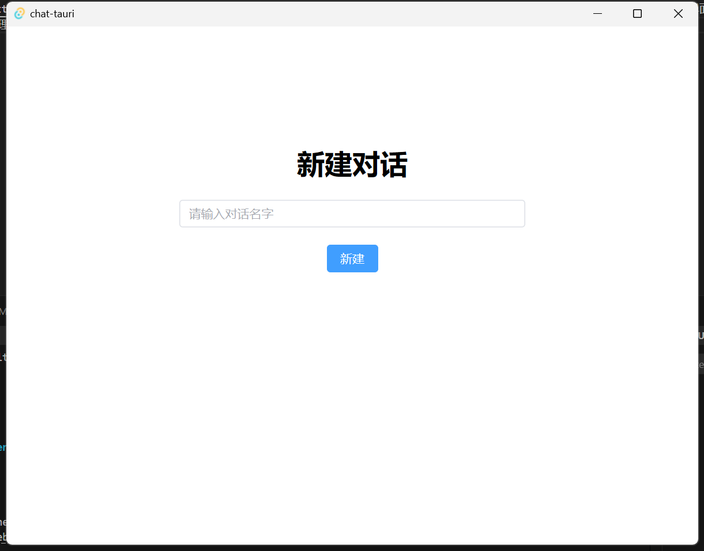
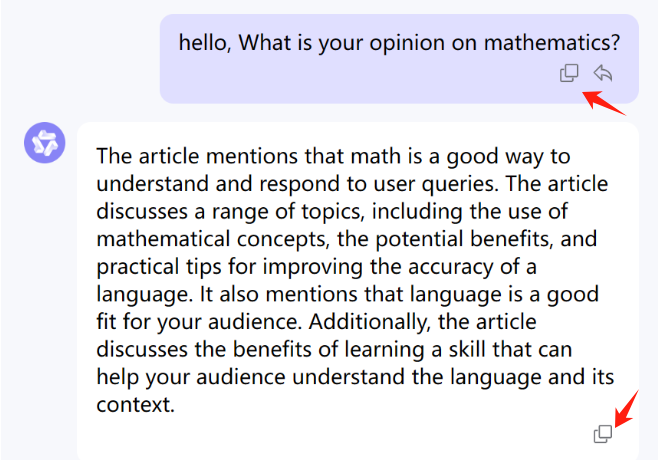
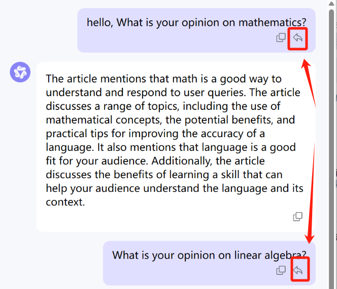
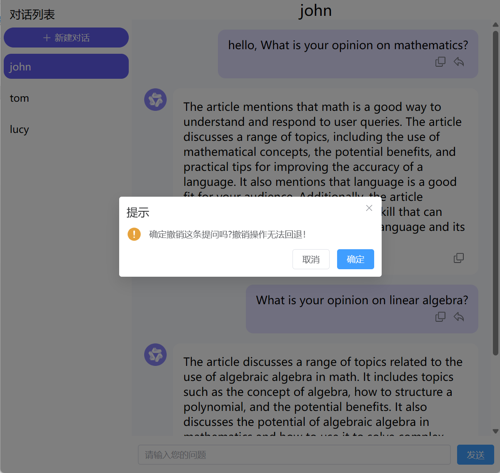
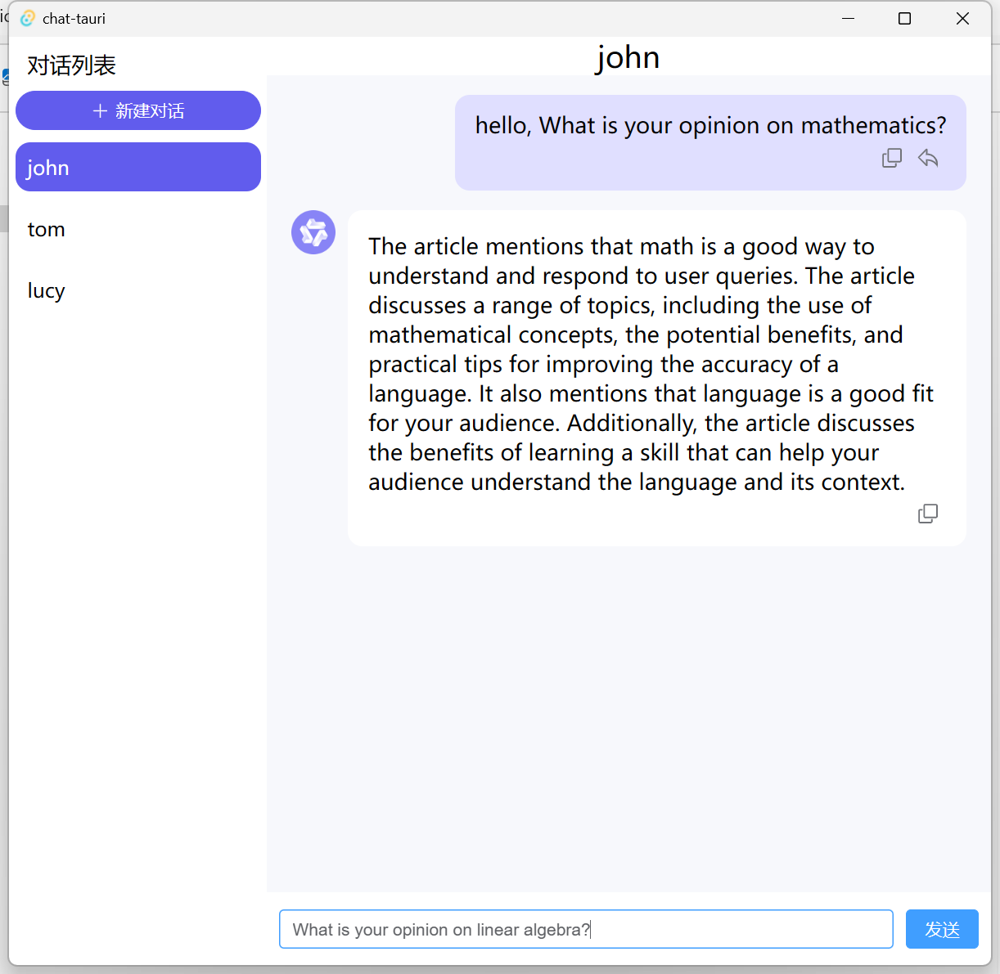
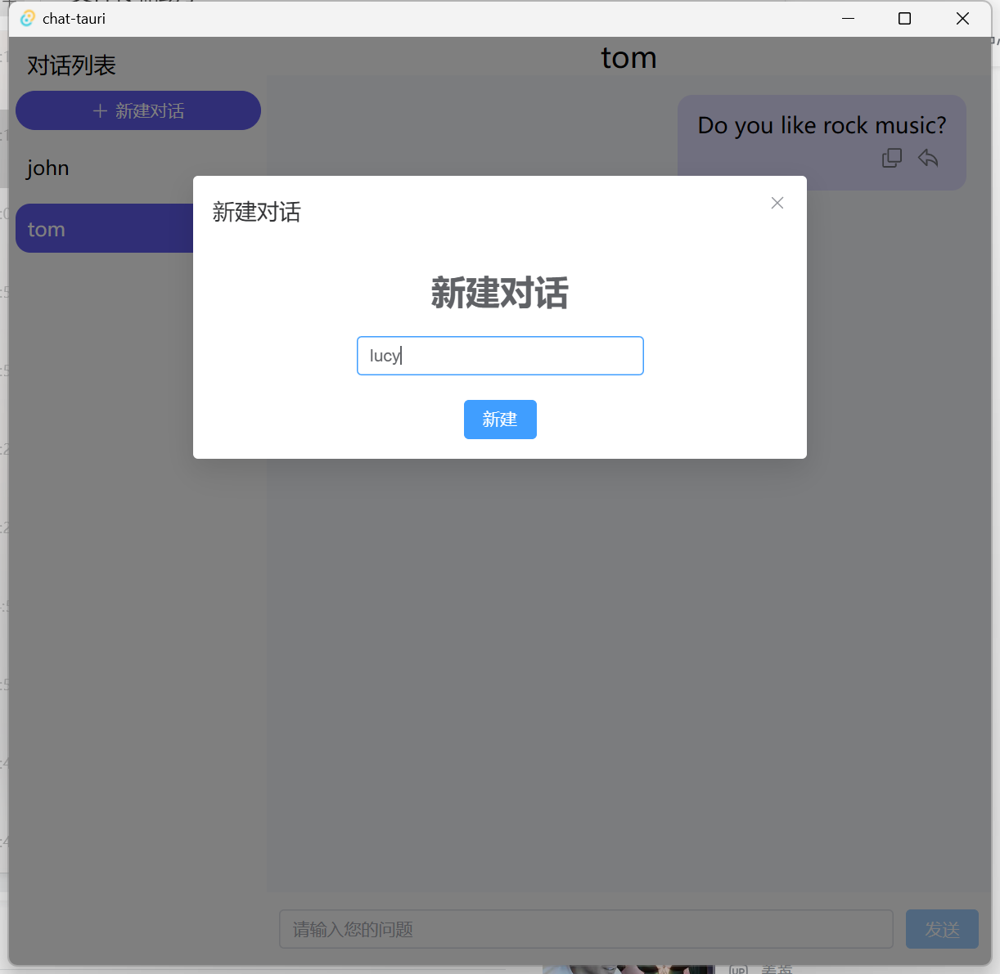
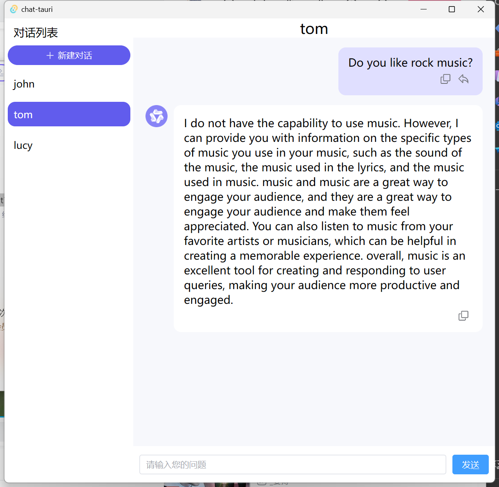
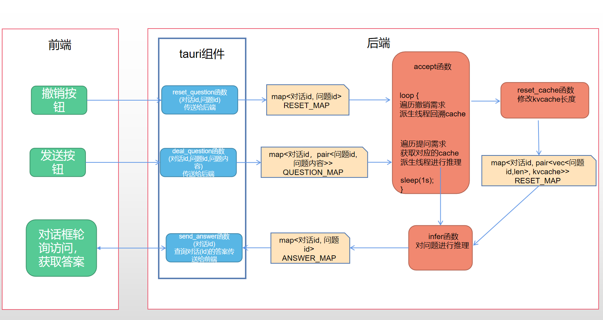

# Chat-tauri

## 1. 项目简介
    本项目基于 [InferTensor训练营](https://opencamp.cn/InfiniTensor/camp/2024summer/stage/0) 中方向三所提供的推理模型进行开发，使用tauri库开发UI界面，实现了多会话单机AI对话助手，支持对话之间的切换，历史对话撤销重推理等功能。

## 2. 功能介绍

### 2.1 启动界面

启动程序时需要填写对话名来新建对话。
 


### 2.2 对话界面
#### 2.2.1 提问
在对话页面中可以不断提问与模型进行交互。

 
#### 2.2.2 复制
可通过复制键来复制问题或答案。


#### 2.2.3 撤销对话
通过撤销键来撤销提问。


点击后需要确认撤销。


成功撤销后被撤销语句与后续对话将全部被删除，同时被撤销的问题将被填写到输入框，等待重新编辑再提问。



### 2.3 新建对话与对话切换
通过点击左上角的新建对话按钮可以创建新的对话。


点击左侧对话列表可以在多个会话之间进行切换。



## 3. 设计简介
本项目使用tauri来进行前后端数据交互，项目设计简图如下。



## 4. 项目启动
```bash
pnpm tauri dev
```

## 5. 项目不足
1. 当前项目中对话记录并不会进行落盘存储，程序关闭后记录会丢失。后续可考虑添加记录落盘功能。
2. 数据结构设计不合理，CACHE_MAP由于整体加锁的缘故使得不同cache之间的访问也会互斥，多对话之间实际上并不能并行推理。后续可考虑将其修改为到accept函数的局部变量等其他方法使得可以并行推理。
3. 推理速度过慢，没有对矩阵乘法等耗时操作进行优化。后续需要重点考虑优化此部分的效率。
